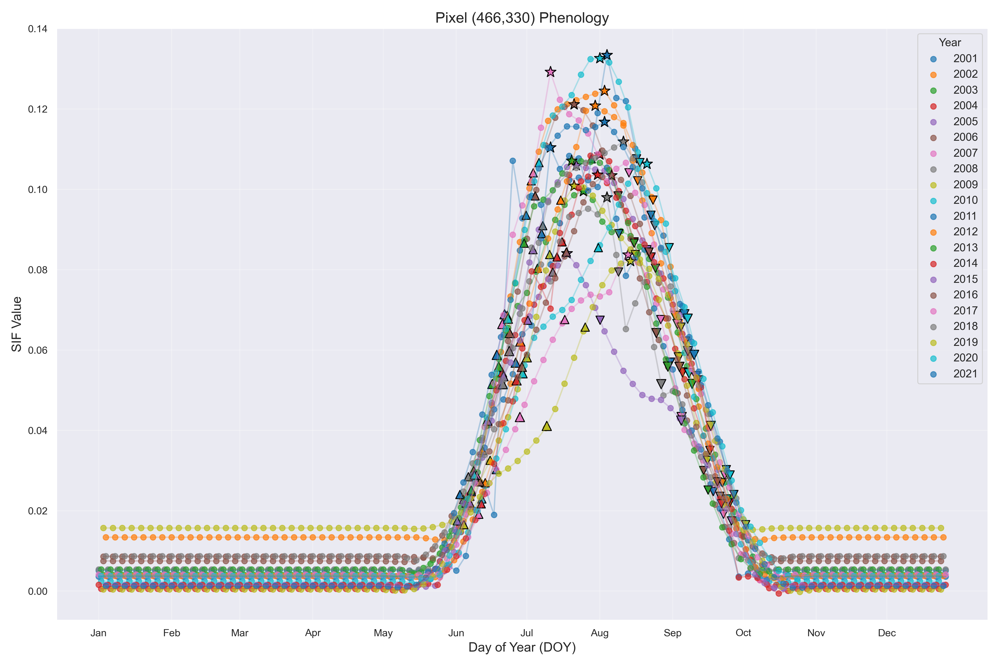
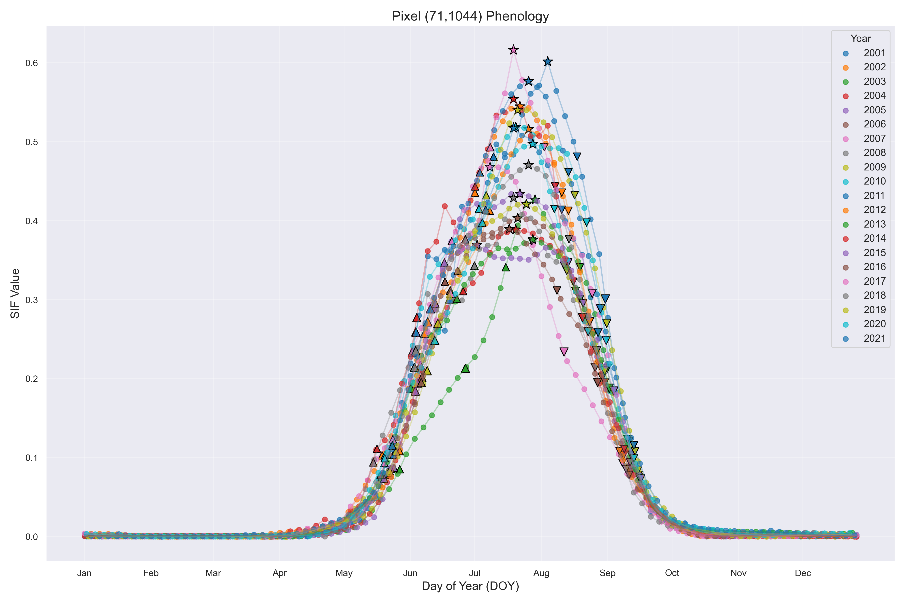
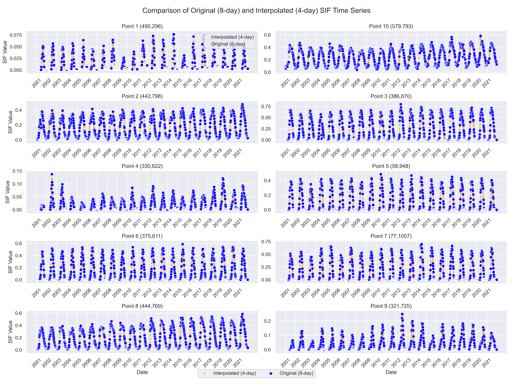

# GOSIF Phenology Project

## Overview
This project involves the analysis of GOSIF data to extract phenological information across China. The data has a spatial resolution of 0.05 degrees and a temporal resolution of 8 days, covering the period from 2001 to 2021.

## Data Description
- **Source**: GOSIF data
- **Resolution**: 0.05 degrees spatial, 8 days temporal
- **Period**: 2001-2021

## Methodology
1. **Land Cover Filtering**: Exclude land use types other than 1 to 11.
2. **Outlier Removal**: Remove values of 32766.
3. **Normalization**: Divide values by 10000.
4. **Negative Value Handling**: Replace values less than 0 with the smallest positive value greater than 0 for that year.
5. **Interpolation**: Interpolate 8-day intervals to 3 days.
6. **SG Filtering**: Apply Savitzky-Golay filter for smoothing.
7. **Phenology Extraction**: Use dynamic thresholding to determine start and end dates of the growing season based on 20%, 50%, and 80% amplitude thresholds.
8. **Temporal Constraints**: Limit extracted phenological points between February 1 and December 31.
9. **Peak Limitation**: Restrict peak points between May 1 and September 30 to avoid multiple growing seasons.

## Results

The following visualizations illustrate the results of the GOSIF phenology analysis:

### Phenology at Specific Pixels
- **Pixel 466_330**: 
  - This image shows the phenological changes at pixel 466_330, highlighting the start and end of the growing season.

- **Pixel 71_1044**: 
  - This visualization captures the phenological cycle at pixel 71_1044, indicating key growth phases.

### Overall Comparison
- **All Points Comparison**: 
  - This plot provides a comprehensive comparison of phenological data across all analyzed points, demonstrating the variability in growth patterns.

These images provide insights into the spatial and temporal dynamics of vegetation growth as captured by the GOSIF data.

## Usage
Instructions on how to run the code and process the data.

## Contributors
List of contributors to the project.

## License
Specify the license under which the project is distributed. 