# 数据探索预处理


```python
import rioxarray as rxr
import numpy as np
import matplotlib.pyplot as plt

# 读取数据
landcover = rxr.open_rasterio('../data/lc_mode_30N.tif')
landcover.plot()

```


    <matplotlib.collections.QuadMesh at 0x28f3537bb20>


    
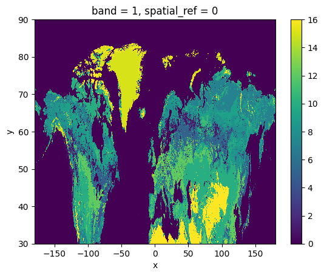
    


```python
import rioxarray as rxr
import numpy as np
import matplotlib.pyplot as plt

# 读取数据
dstemp = rxr.open_rasterio('E:/data/GOSIF/gosif_china/gosif_2001001.tif')

# 数据处理：
# 1. 将小于0的值设置为0
# 2. 将32766异常值设置为NaN
# 3. 将所有数值除以10000
dstemp_processed = dstemp.copy()
dstemp_processed = dstemp_processed.where(dstemp_processed != 32766, np.nan)  # 将32766设为NaN
dstemp_processed = dstemp_processed.where(dstemp_processed >= 0, 0)  # 将小于0的值设为0
dstemp_processed = dstemp_processed / 10000  # 所有值除以10000

# 绘制处理后的数据

dstemp_processed.plot()


```


    <matplotlib.collections.QuadMesh at 0x28f35100190>


    
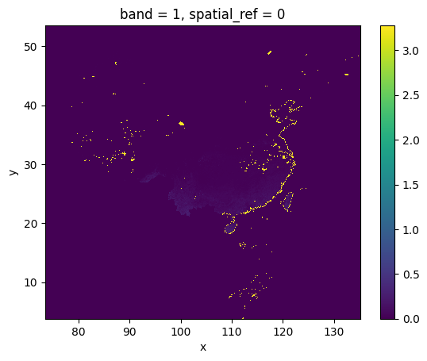
    


```python
# 读取数据
dstemp = rxr.open_rasterio('E:/data/GOSIF/gosif_china/gosif_2001001.tif')

# 导出tif的四周边界shp
import geopandas as gpd
from shapely.geometry import box

# 获取栅格的边界坐标
minx, miny, maxx, maxy = dstemp.rio.bounds()

# 创建边界框
boundary_box = box(minx, miny, maxx, maxy)

# 创建GeoDataFrame
boundary_gdf = gpd.GeoDataFrame(geometry=[boundary_box], crs=dstemp.rio.crs)

# 转换为WGS84坐标系
boundary_gdf = boundary_gdf.to_crs('EPSG:4326')

# 保存为shapefile
output_path = '../data/gosif_boundary.shp'
boundary_gdf.to_file(output_path)

print(f"边界shapefile已保存到: {output_path}")
```

    边界shapefile已保存到: ../data/gosif_boundary.shp
    


```python
import os
import ee
import geemap
os.environ['HTTP_PROXY'] = 'http://127.0.0.1:7890'
os.environ['HTTPS_PROXY'] = 'http://127.0.0.1:7890'
Map = geemap.Map()
geemap.ee_initialize()
```


```python
# 导入必要的库
import os
import ee
import geemap

# 定义输出路径
output_dir = '../data'
os.makedirs(output_dir, exist_ok=True)

# 加载MCD12产品
mcd12 = ee.ImageCollection("MODIS/061/MCD12Q1")

# 筛选2021年的数据
mcd12_2021 = mcd12.filter(ee.Filter.date('2021-01-01', '2021-12-31')).first()

# 选择LC_Type1波段(IGBP分类)
mcd12_lc_type1 = mcd12_2021.select('LC_Type1')

# 加载本地shapefile作为裁剪区域
gosif_boundary = geemap.shp_to_ee('../data/gosif_boundary.shp')

# 使用边界进行裁剪
mcd12_clipped = mcd12_lc_type1.clip(gosif_boundary)


# 下载裁剪后的影像
output_file = os.path.join(output_dir, 'MCD12_2021_LC_Type1.tif')
geemap.ee_export_image(mcd12_clipped, crs='epsg:4326', scale=5566, region=gosif_boundary.geometry(), filename=output_file)

print(f"MCD12 2021年土地覆盖数据已下载到: {output_file}")

# 可视化结果
Map.centerObject(gosif_boundary, 5)
Map.addLayer(mcd12_clipped, {'min': 1, 'max': 17, 'palette': 'Spectral'}, 'MCD12 2021 Land Cover')
Map

```


<style>
    .geemap-dark {
        --jp-widgets-color: white;
        --jp-widgets-label-color: white;
        --jp-ui-font-color1: white;
        --jp-layout-color2: #454545;
        background-color: #383838;
    }

    .geemap-dark .jupyter-button {
        --jp-layout-color3: #383838;
    }

    .geemap-colab {
        background-color: var(--colab-primary-surface-color, white);
    }

    .geemap-colab .jupyter-button {
        --jp-layout-color3: var(--colab-primary-surface-color, white);
    }
</style>


    Generating URL ...
    Downloading data from https://earthengine.googleapis.com/v1/projects/313070866604/thumbnails/7c5d141b38ab4aa546f0d290c69ef3c3-60b338be5b76e06fbd704cedf15bc445:getPixels
    Please wait ...
    Data downloaded to d:\Onedrive\GitHub\GOSIF_phenology\data\MCD12_2021_LC_Type1.tif
    MCD12 2021年土地覆盖数据已下载到: ../data\MCD12_2021_LC_Type1.tif
    


    Map(bottom=3737.0, center=[27.791252625314264, 104.29999999999959], controls=(WidgetControl(options=['position…


这里发现只有2021年的GOSIF维度不对，其余年都是（995 * 1232），而2021年是（995 * 1231）


```python
import os
import glob
import numpy as np
import rasterio
from tqdm import tqdm

# 定义路径
gosif_dir = r'E:\data\GOSIF\gosif_china'
output_dir = r'E:\data\GOSIF\gosif_2021new'
os.makedirs(output_dir, exist_ok=True)

# 获取2021年的所有tif文件
gosif_files_2021 = glob.glob(os.path.join(gosif_dir, 'gosif_2021*.tif'))


for file_path in tqdm(gosif_files_2021, desc="处理2021年文件"):
    with rasterio.open(file_path) as src:
        data = src.read()
        meta = src.meta.copy()
        
        file_name = os.path.basename(file_path)
        
        # 在最左边添加一列NaN值
        bands, height, width = data.shape
        
        # 创建新的数据数组，宽度+1
        new_data = np.zeros((bands, height, width + 1), dtype=data.dtype)
        
        # 在最左边填充NaN值
        if np.issubdtype(data.dtype, np.integer):
            if 'nodata' in meta:
                new_data[:, :, 0] = meta['nodata']
            else:
                new_data[:, :, 0] = 0  # 如果没有nodata值，使用0
        else:
            new_data[:, :, 0] = np.nan
        
        new_data[:, :, 1:] = data
        
        meta.update({
            'width': width + 1,
            'transform': rasterio.Affine(
                meta['transform'].a,
                meta['transform'].b,
                meta['transform'].c,  # 保持左上角x坐标不变
                meta['transform'].d,
                meta['transform'].e,
                meta['transform'].f   # 保持左上角y坐标不变
            )
        })
        
        # 保存新文件
        output_path = os.path.join(output_dir, file_name)
        with rasterio.open(output_path, 'w', **meta) as dst:
            dst.write(new_data)

print(f"所有2021年文件处理完成，已保存到: {output_dir}")

```


<style>
    .geemap-dark {
        --jp-widgets-color: white;
        --jp-widgets-label-color: white;
        --jp-ui-font-color1: white;
        --jp-layout-color2: #454545;
        background-color: #383838;
    }

    .geemap-dark .jupyter-button {
        --jp-layout-color3: #383838;
    }

    .geemap-colab {
        background-color: var(--colab-primary-surface-color, white);
    }

    .geemap-colab .jupyter-button {
        --jp-layout-color3: var(--colab-primary-surface-color, white);
    }
</style>


    处理2021年文件: 100%|██████████| 46/46 [00:00<00:00, 53.94it/s]

    所有2021年文件处理完成，已保存到: E:\data\GOSIF\gosif_2021new
    

    
    


```python
import rioxarray as rxr
import numpy as np
import matplotlib.pyplot as plt

# 读取数据
landcover = rxr.open_rasterio('../data/MCD12_2021_LC_Type1_trimmed.tif')
landcover.plot()

```


<style>
    .geemap-dark {
        --jp-widgets-color: white;
        --jp-widgets-label-color: white;
        --jp-ui-font-color1: white;
        --jp-layout-color2: #454545;
        background-color: #383838;
    }

    .geemap-dark .jupyter-button {
        --jp-layout-color3: #383838;
    }

    .geemap-colab {
        background-color: var(--colab-primary-surface-color, white);
    }

    .geemap-colab .jupyter-button {
        --jp-layout-color3: var(--colab-primary-surface-color, white);
    }
</style>


    <matplotlib.collections.QuadMesh at 0x279e8ac5d00>


    
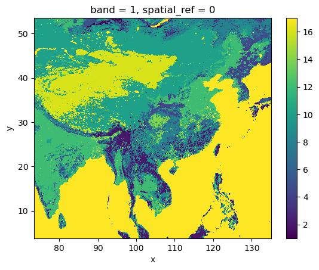
    


```python
landcover.shape
```


<style>
    .geemap-dark {
        --jp-widgets-color: white;
        --jp-widgets-label-color: white;
        --jp-ui-font-color1: white;
        --jp-layout-color2: #454545;
        background-color: #383838;
    }

    .geemap-dark .jupyter-button {
        --jp-layout-color3: #383838;
    }

    .geemap-colab {
        background-color: var(--colab-primary-surface-color, white);
    }

    .geemap-colab .jupyter-button {
        --jp-layout-color3: var(--colab-primary-surface-color, white);
    }
</style>


    (1, 995, 1232)


# 数据预处理


```python
data[0, 0]
```


    9.999999747378752e-05


```python
import os
import numpy as np
import xarray as xr
import rioxarray as rxr
import glob
from tqdm import tqdm

# 定义路径
gosif_dir = r'E:\data\GOSIF\gosif_china'
lc_file = r'../data/MCD12_2021_LC_Type1_trimmed.tif'
output_dir = r'E:\data\GOSIF\gosif_china_processed'
os.makedirs(output_dir, exist_ok=True)

# 读取土地覆盖数据，使用masked=True处理nodata
lc_data = rxr.open_rasterio(lc_file, masked=True)
# 创建土地覆盖掩码（保留1-11的土地利用类型）
lc_mask = np.logical_and(lc_data.values[0] >= 1, lc_data.values[0] <= 11)

# 获取所有GOSIF文件
gosif_files = sorted(glob.glob(os.path.join(gosif_dir, 'gosif_*.tif')))

# 按年份组织文件
year_files = {}
for file in gosif_files:
    year = os.path.basename(file)[6:10]  # 提取年份信息
    if year not in year_files:
        year_files[year] = []
    year_files[year].append(file)

# 处理每一年的数据
for year, files in tqdm(year_files.items(), desc="处理年份"):
    print(f"正在处理 {year} 年数据...")
    
    # 1. 首先读取该年所有数据
    year_data_list = []
    time_values = []
    
    for file in tqdm(files, desc=f"读取{year}年文件"):
        # 使用rioxarray读取数据
        data = rxr.open_rasterio(file, masked=True)
        year_data_list.append(data)
        # 提取日期信息
        time_values.append(os.path.basename(file)[6:13])
    
    # 2. 将数据合并为一个多维xarray - 直接指定维度名称为'time'
    year_dataset = xr.concat(year_data_list, dim='time')
    
    # 设置时间坐标
    year_dataset = year_dataset.assign_coords({'time': time_values})
    
    # 3. 应用掩码：土地覆盖掩码和异常值掩码
    # 转为numpy数组处理会更快
    data_array = year_dataset.values
    
    # 应用土地覆盖掩码
    for i in range(data_array.shape[0]):
        data_array[i, 0] = np.where(lc_mask, data_array[i, 0], np.nan)
        # 处理异常值
        data_array[i, 0] = np.where(data_array[i, 0] == 32766, np.nan, data_array[i, 0])
    
    # 将修改后的数据写回xarray
    year_dataset.values = data_array
    
    # 4. 数值除以10000
    year_dataset = year_dataset / 10000.0
    
    # 5. 为每个像素计算时间序列中大于0的最小值
    # 创建一个掩码，表示哪些值大于0
    positive_data = year_dataset.where(year_dataset > 0)
    
    # 沿时间轴找出每个像素位置的最小非NaN值
    min_positive = positive_data.min(dim='time')
    
    # 对于完全没有正值的像素，设置一个默认的最小正值
    min_positive_array = min_positive.values[0].copy()
    min_positive_array = np.where(np.isnan(min_positive_array), 0.0001, min_positive_array)
    
    print(f"{year}年处理统计:")
    print(f"  有效像素百分比: {np.sum(~np.isnan(min_positive_array))/min_positive_array.size:.2%}")
    print(f"  最小正值范围: {np.nanmin(min_positive_array):.6f} - {np.nanmax(min_positive_array):.6f}")
    
    # 6. 将小于0的值替换为该像素点在当年时间序列中大于0的最小值
    for i in tqdm(range(len(files)), desc=f"处理{year}年文件"):
        file = files[i]
        output_file = os.path.join(output_dir, os.path.basename(file))
        
        # 获取当前时间点的数据
        current_data = year_dataset.isel(time=i).copy()
        data_values = current_data.values[0]
        
        # 将小于0的值替换为该像素点在当年时间序列中大于0的最小值
        data_values = np.where(np.logical_and(~np.isnan(data_values), data_values < 0), 
                              min_positive_array, data_values)
        
        # 更新数据
        current_data.values[0] = data_values
        
        # 保存处理后的文件
        current_data.rio.to_raster(output_file, dtype="float32")
    
    print(f"{year}年数据处理完成")

print("所有GOSIF数据预处理完成！")
```

    处理年份:   0%|          | 0/21 [00:00<?, ?it/s]

    正在处理 2001 年数据...
    

    读取2001年文件: 100%|██████████| 46/46 [00:00<00:00, 209.75it/s]
    

    2001年处理统计:
      有效像素百分比: 100.00%
      最小正值范围: 0.000100 - 3.276700
    

    处理2001年文件: 100%|██████████| 46/46 [00:00<00:00, 47.51it/s]
    处理年份:   5%|▍         | 1/21 [00:02<00:53,  2.67s/it]

    2001年数据处理完成
    正在处理 2002 年数据...
    

    读取2002年文件: 100%|██████████| 46/46 [00:00<00:00, 162.90it/s]
    

    2002年处理统计:
      有效像素百分比: 100.00%
      最小正值范围: 0.000100 - 3.276700
    

    处理2002年文件: 100%|██████████| 46/46 [00:00<00:00, 46.10it/s]
    处理年份:  10%|▉         | 2/21 [00:05<00:51,  2.73s/it]

    2002年数据处理完成
    正在处理 2003 年数据...
    

    读取2003年文件: 100%|██████████| 46/46 [00:00<00:00, 175.23it/s]
    

    2003年处理统计:
      有效像素百分比: 100.00%
      最小正值范围: 0.000100 - 3.276700
    

    处理2003年文件: 100%|██████████| 46/46 [00:00<00:00, 46.58it/s]
    处理年份:  14%|█▍        | 3/21 [00:08<00:50,  2.78s/it]

    2003年数据处理完成
    正在处理 2004 年数据...
    

    读取2004年文件: 100%|██████████| 46/46 [00:00<00:00, 174.57it/s]
    

    2004年处理统计:
      有效像素百分比: 100.00%
      最小正值范围: 0.000100 - 3.276700
    

    处理2004年文件: 100%|██████████| 46/46 [00:01<00:00, 45.10it/s]
    处理年份:  19%|█▉        | 4/21 [00:11<00:47,  2.82s/it]

    2004年数据处理完成
    正在处理 2005 年数据...
    

    读取2005年文件: 100%|██████████| 46/46 [00:00<00:00, 176.16it/s]
    

    2005年处理统计:
      有效像素百分比: 100.00%
      最小正值范围: 0.000100 - 3.276700
    

    处理2005年文件: 100%|██████████| 46/46 [00:01<00:00, 37.23it/s]
    处理年份:  24%|██▍       | 5/21 [00:14<00:46,  2.88s/it]

    2005年数据处理完成
    正在处理 2006 年数据...
    

    读取2006年文件: 100%|██████████| 46/46 [00:00<00:00, 166.36it/s]
    

    2006年处理统计:
      有效像素百分比: 100.00%
      最小正值范围: 0.000100 - 3.276700
    

    处理2006年文件: 100%|██████████| 46/46 [00:01<00:00, 24.07it/s]
    处理年份:  29%|██▊       | 6/21 [00:17<00:47,  3.14s/it]

    2006年数据处理完成
    正在处理 2007 年数据...
    

    读取2007年文件: 100%|██████████| 46/46 [00:00<00:00, 149.97it/s]
    

    2007年处理统计:
      有效像素百分比: 100.00%
      最小正值范围: 0.000100 - 3.276700
    

    处理2007年文件: 100%|██████████| 46/46 [00:01<00:00, 23.21it/s]
    处理年份:  33%|███▎      | 7/21 [00:21<00:47,  3.37s/it]

    2007年数据处理完成
    正在处理 2008 年数据...
    

    读取2008年文件: 100%|██████████| 46/46 [00:00<00:00, 194.34it/s]
    

    2008年处理统计:
      有效像素百分比: 100.00%
      最小正值范围: 0.000100 - 3.276700
    

    处理2008年文件: 100%|██████████| 46/46 [00:01<00:00, 30.78it/s]
    处理年份:  38%|███▊      | 8/21 [00:24<00:43,  3.31s/it]

    2008年数据处理完成
    正在处理 2009 年数据...
    

    读取2009年文件: 100%|██████████| 46/46 [00:00<00:00, 128.50it/s]
    

    2009年处理统计:
      有效像素百分比: 100.00%
      最小正值范围: 0.000100 - 3.276700
    

    处理2009年文件: 100%|██████████| 46/46 [00:02<00:00, 16.97it/s]
    处理年份:  43%|████▎     | 9/21 [00:29<00:44,  3.69s/it]

    2009年数据处理完成
    正在处理 2010 年数据...
    

    读取2010年文件: 100%|██████████| 46/46 [00:00<00:00, 169.13it/s]
    

    2010年处理统计:
      有效像素百分比: 100.00%
      最小正值范围: 0.000100 - 3.276700
    

    处理2010年文件: 100%|██████████| 46/46 [00:01<00:00, 25.54it/s]
    处理年份:  48%|████▊     | 10/21 [00:32<00:39,  3.63s/it]

    2010年数据处理完成
    正在处理 2011 年数据...
    

    读取2011年文件: 100%|██████████| 46/46 [00:00<00:00, 185.33it/s]
    

    2011年处理统计:
      有效像素百分比: 100.00%
      最小正值范围: 0.000100 - 3.276700
    

    处理2011年文件: 100%|██████████| 46/46 [00:09<00:00,  4.71it/s]
    处理年份:  52%|█████▏    | 11/21 [00:44<01:00,  6.01s/it]

    2011年数据处理完成
    正在处理 2012 年数据...
    

    读取2012年文件: 100%|██████████| 46/46 [00:00<00:00, 185.78it/s]
    

    2012年处理统计:
      有效像素百分比: 100.00%
      最小正值范围: 0.000100 - 3.276700
    

    处理2012年文件: 100%|██████████| 46/46 [00:01<00:00, 30.76it/s]
    处理年份:  57%|█████▋    | 12/21 [00:47<00:46,  5.15s/it]

    2012年数据处理完成
    正在处理 2013 年数据...
    

    读取2013年文件: 100%|██████████| 46/46 [00:00<00:00, 175.76it/s]
    

    2013年处理统计:
      有效像素百分比: 100.00%
      最小正值范围: 0.000100 - 3.276700
    

    处理2013年文件: 100%|██████████| 46/46 [00:01<00:00, 38.08it/s]
    处理年份:  62%|██████▏   | 13/21 [00:50<00:35,  4.46s/it]

    2013年数据处理完成
    正在处理 2014 年数据...
    

    读取2014年文件: 100%|██████████| 46/46 [00:00<00:00, 146.13it/s]
    

    2014年处理统计:
      有效像素百分比: 100.00%
      最小正值范围: 0.000100 - 3.276700
    

    处理2014年文件: 100%|██████████| 46/46 [00:01<00:00, 24.63it/s]
    处理年份:  67%|██████▋   | 14/21 [00:53<00:29,  4.23s/it]

    2014年数据处理完成
    正在处理 2015 年数据...
    

    读取2015年文件: 100%|██████████| 46/46 [00:00<00:00, 187.16it/s]
    

    2015年处理统计:
      有效像素百分比: 100.00%
      最小正值范围: 0.000100 - 3.276700
    

    处理2015年文件: 100%|██████████| 46/46 [00:01<00:00, 25.29it/s]
    处理年份:  71%|███████▏  | 15/21 [00:57<00:24,  4.02s/it]

    2015年数据处理完成
    正在处理 2016 年数据...
    

    读取2016年文件: 100%|██████████| 46/46 [00:00<00:00, 161.49it/s]
    

    2016年处理统计:
      有效像素百分比: 100.00%
      最小正值范围: 0.000100 - 3.276700
    

    处理2016年文件: 100%|██████████| 46/46 [00:01<00:00, 26.65it/s]
    处理年份:  76%|███████▌  | 16/21 [01:01<00:19,  3.87s/it]

    2016年数据处理完成
    正在处理 2017 年数据...
    

    读取2017年文件: 100%|██████████| 46/46 [00:00<00:00, 158.81it/s]
    

    2017年处理统计:
      有效像素百分比: 100.00%
      最小正值范围: 0.000100 - 3.276700
    

    处理2017年文件: 100%|██████████| 46/46 [00:02<00:00, 16.49it/s]
    处理年份:  81%|████████  | 17/21 [01:05<00:16,  4.05s/it]

    2017年数据处理完成
    正在处理 2018 年数据...
    

    读取2018年文件: 100%|██████████| 46/46 [00:00<00:00, 175.26it/s]
    

    2018年处理统计:
      有效像素百分比: 100.00%
      最小正值范围: 0.000100 - 3.276700
    

    处理2018年文件: 100%|██████████| 46/46 [00:02<00:00, 22.24it/s]
    处理年份:  86%|████████▌ | 18/21 [01:09<00:12,  4.02s/it]

    2018年数据处理完成
    正在处理 2019 年数据...
    

    读取2019年文件: 100%|██████████| 46/46 [00:00<00:00, 146.51it/s]
    

    2019年处理统计:
      有效像素百分比: 100.00%
      最小正值范围: 0.000100 - 3.276700
    

    处理2019年文件: 100%|██████████| 46/46 [00:01<00:00, 27.48it/s]
    处理年份:  90%|█████████ | 19/21 [01:12<00:07,  3.85s/it]

    2019年数据处理完成
    正在处理 2020 年数据...
    

    读取2020年文件: 100%|██████████| 46/46 [00:00<00:00, 176.49it/s]
    

    2020年处理统计:
      有效像素百分比: 100.00%
      最小正值范围: 0.000100 - 3.276700
    

    处理2020年文件: 100%|██████████| 46/46 [00:04<00:00, 11.39it/s]
    处理年份:  95%|█████████▌| 20/21 [01:18<00:04,  4.46s/it]

    2020年数据处理完成
    正在处理 2021 年数据...
    

    读取2021年文件: 100%|██████████| 46/46 [00:00<00:00, 133.74it/s]
    

    2021年处理统计:
      有效像素百分比: 100.00%
      最小正值范围: 0.000100 - 3.276700
    

    处理2021年文件: 100%|██████████| 46/46 [00:01<00:00, 27.13it/s]
    处理年份: 100%|██████████| 21/21 [01:22<00:00,  3.92s/it]

    2021年数据处理完成
    所有GOSIF数据预处理完成！
    

    
    


```python
import rioxarray as rxr
import numpy as np
import matplotlib.pyplot as plt
from matplotlib.colors import Normalize

# 读取数据
da = rxr.open_rasterio('E:/data/GOSIF/gosif_china_processed/gosif_2001161.tif')
# 使用尖尖的颜色卡，设置范围为0-2
plt.figure(figsize=(8, 6))
da.plot(cmap='RdBu', norm=Normalize(vmin=0, vmax=1))


```


    <matplotlib.collections.QuadMesh at 0x1d212808cd0>


    
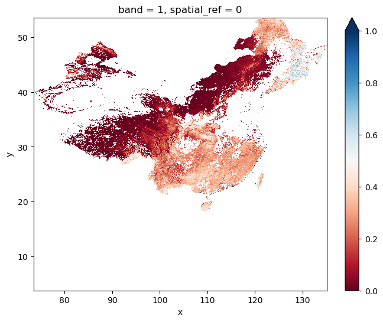
    


```python
import glob
import numpy as np
import rioxarray as rxr
import pandas as pd
import matplotlib.pyplot as plt
import seaborn as sns
from datetime import datetime

# 设置随机种子
np.random.seed(42)

# 获取所有文件路径
gosif_files = sorted(glob.glob('E:/data/GOSIF/gosif_china_processed/gosif_*.tif'))
print(f"找到 {len(gosif_files)} 个文件")

# 创建日期列表
dates = [datetime.strptime(f.split('\\')[-1][6:13], '%Y%j') for f in gosif_files]

# 读取第一个文件获取形状信息和掩码
first_data = rxr.open_rasterio(gosif_files[0], masked=True)
height, width = first_data.shape[1], first_data.shape[2]
mask = ~np.isnan(first_data.values[0])

# 获取所有非NaN像素的坐标
y_indices, x_indices = np.where(mask)
valid_count = len(y_indices)
print(f"找到 {valid_count} 个非NaN像素点")

# 加载所有数据到一个3D数组 (时间, 高度, 宽度)
print("正在加载所有数据...")
all_data = np.full((len(gosif_files), height, width), np.nan)
for i, file in enumerate(gosif_files):
    all_data[i] = rxr.open_rasterio(file, masked=True).values[0]

# 随机选择10个有效像素点
selected_indices = np.random.choice(valid_count, min(10, valid_count), replace=False)
selected_y = y_indices[selected_indices]
selected_x = x_indices[selected_indices]

# 设置seaborn风格
sns.set_style("darkgrid")

# 为每个选择的像素点分别绘制时间序列图
for i, (y, x) in enumerate(zip(selected_y, selected_x)):
    # 提取该点的时间序列
    time_series = all_data[:, y, x]
    
    # 创建数据框
    df = pd.DataFrame({"SIF": time_series}, index=dates)
    
    # 绘图 - 使用更小的图尺寸
    plt.figure(figsize=(8, 3))
    sns.lineplot(data=df, x=df.index, y="SIF")
    plt.title(f' ({y},{x}) SIF time series')
    plt.xlabel('time')
    plt.ylabel('SIF')
    plt.xticks(rotation=45)
    plt.tight_layout()
    plt.show()
    
```

    找到 966 个文件
    找到 222063 个非NaN像素点
    正在加载所有数据...
    


    
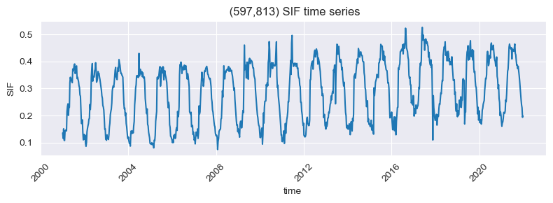
    


    
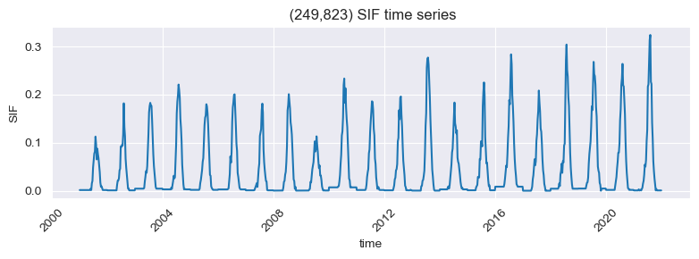
    


    
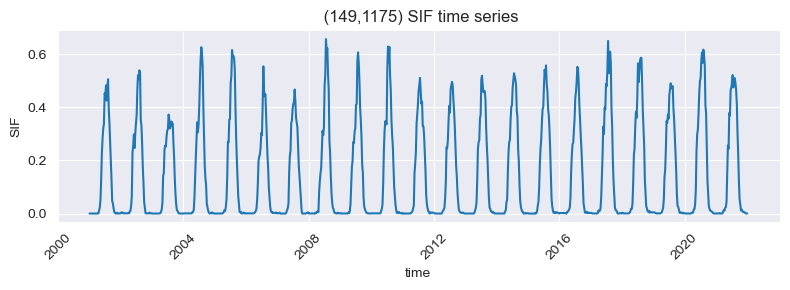
    


    
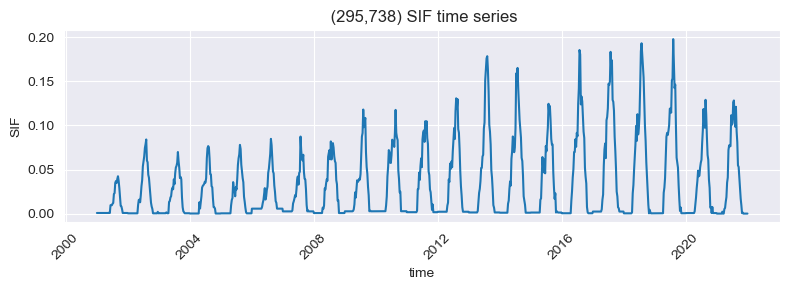
    


    
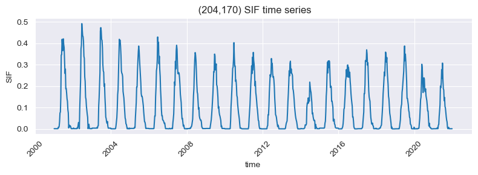
    


    
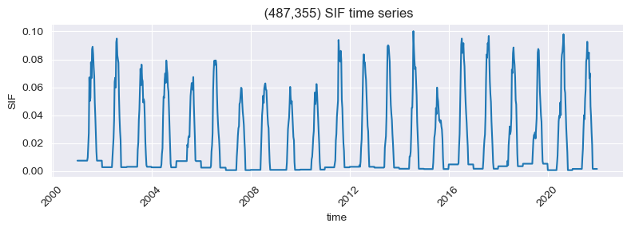
    


    
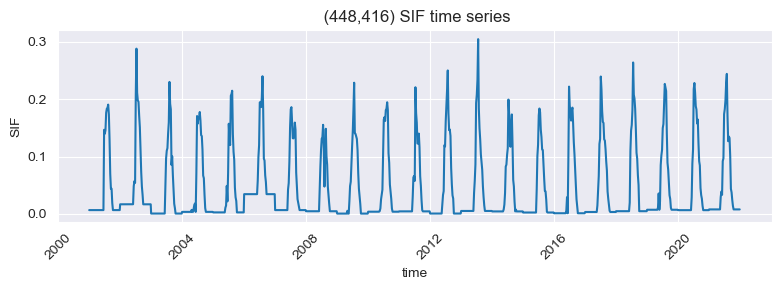
    


    
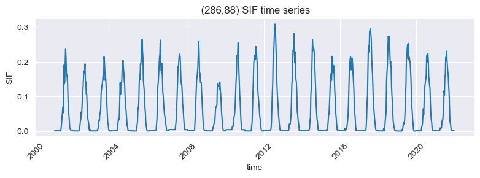
    


    
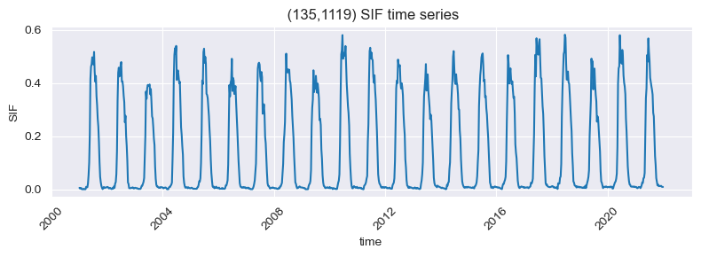
    


    
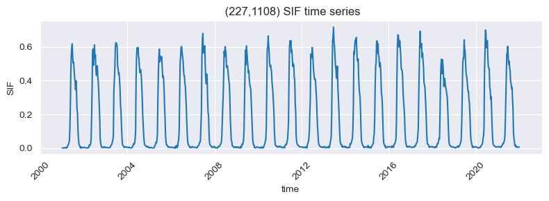
    


# SG滤波


```python
import os
import glob
import numpy as np
import rioxarray as rxr
from scipy.signal import savgol_filter
from datetime import datetime, timedelta
import matplotlib.pyplot as plt
from tqdm import tqdm
import pandas as pd
from scipy.interpolate import interp1d

# 输入和输出目录
input_dir = 'E:/data/GOSIF/gosif_china_processed'
output_dir = 'E:/data/GOSIF/gosif_china_4day'

# 创建输出目录（如果不存在）
os.makedirs(output_dir, exist_ok=True)

# 获取所有8天间隔的文件
gosif_files = sorted(glob.glob(os.path.join(input_dir, 'gosif_*.tif')))
print(f"找到 {len(gosif_files)} 个8天间隔的文件")

# 创建日期列表 - 从文件名中提取年份和日期
dates_8day = []
for file in gosif_files:
    filename = os.path.basename(file)
    year = int(filename[6:10])
    day = int(filename[10:13])
    date = datetime(year, 1, 1) + timedelta(days=day-1)
    dates_8day.append(date)

# 创建新的4天间隔日期列表
start_date = dates_8day[0]
end_date = dates_8day[-1]
dates_4day = []
current_date = start_date
while current_date <= end_date:
    dates_4day.append(current_date)
    current_date += timedelta(days=4)

print(f"原始8天间隔数据点: {len(dates_8day)}")
print(f"新的4天间隔数据点: {len(dates_4day)}")

# 按年份分组日期
years = sorted(list(set([d.year for d in dates_8day])))
print(f"数据包含 {len(years)} 个年份: {years}")

# 读取第一个文件以获取元数据和空间维度
template = rxr.open_rasterio(gosif_files[0])
height, width = template.shape[1], template.shape[2]

# 加载所有数据到一个3D矩阵
print("正在加载数据到3D矩阵...")
data_3d = np.full((len(gosif_files), height, width), np.nan)
for i, file in tqdm(enumerate(gosif_files), total=len(gosif_files)):
    data_3d[i] = rxr.open_rasterio(file, masked=True).values[0]

# 创建有效像素的掩码
print("计算有效像素掩码...")
valid_pixels_count = np.sum(~np.isnan(data_3d), axis=0)
valid_mask = valid_pixels_count > 0  # 只要有数据就处理
valid_y, valid_x = np.where(valid_mask)
print(f"找到 {len(valid_y)} 个有效像素")

# 转换日期列表到天数（相对于开始日期的天数）
days_8day = np.array([(date - start_date).days for date in dates_8day])
days_4day = np.array([(date - start_date).days for date in dates_4day])

# 创建输出数据矩阵
print("创建输出矩阵...")
data_4day = np.full((len(dates_4day), height, width), np.nan)

# 改进的SG滤波和插值方法 - 按年份处理
print("对有效像素进行分年度SG滤波和插值...")
for i in tqdm(range(len(valid_y))):
    y, x = valid_y[i], valid_x[i]
    
    # 提取该像素的时间序列
    pixel_data = data_3d[:, y, x]
    
    # 按年份分别处理
    for year in years:
        # 获取当前年份的日期索引和数据
        year_indices_8day = [i for i, d in enumerate(dates_8day) if d.year == year]
        year_days_8day = days_8day[year_indices_8day]
        year_data_8day = pixel_data[year_indices_8day]
        
        # 找出当前年份对应的4天间隔的索引
        year_indices_4day = [i for i, d in enumerate(dates_4day) if d.year == year]
        year_days_4day = days_4day[year_indices_4day]
        
        # 检查是否有足够的有效数据点
        valid_mask = ~np.isnan(year_data_8day)
        if np.sum(valid_mask) < 5:  # 需要至少5个点进行SG滤波
            continue
        
        # 只使用有效数据点
        valid_days = year_days_8day[valid_mask]
        valid_data = year_data_8day[valid_mask]
        
        # 为了确保SG滤波器窗口适合数据特性，动态调整窗口大小和多项式阶数
        n_valid = len(valid_data)
        
        # 调整SG滤波参数
        if n_valid < 7:
            window_length = 5
            polyorder = 2
        elif n_valid < 11:
            window_length = 7
            polyorder = 3
        else:
            window_length = 9
            polyorder = 3
        
        # 确保窗口长度是奇数且不超过数据长度
        window_length = min(window_length, n_valid - (n_valid % 2 == 0))
        if window_length % 2 == 0:
            window_length -= 1
        
        # 如果窗口长度小于5，回退到最小要求
        if window_length < 5:
            window_length = 5
            polyorder = min(2, window_length - 1)
        
        # 应用SG滤波平滑原始数据
        try:
            smoothed_data = savgol_filter(valid_data, window_length, polyorder)
            
            # 使用线性插值将SG滤波结果插值到4天间隔
            f_interp = interp1d(valid_days, smoothed_data, kind='linear', bounds_error=False, fill_value=np.nan)
            interpolated_values = f_interp(year_days_4day)
            
            # 保存插值结果
            for j, idx_4day in enumerate(year_indices_4day):
                # 只填充原始数据不存在的点
                if dates_4day[idx_4day] not in dates_8day:
                    data_4day[idx_4day, y, x] = interpolated_values[j]
                else:
                    # 对于原始8天数据已有的点，直接使用原始值
                    original_idx = dates_8day.index(dates_4day[idx_4day])
                    data_4day[idx_4day, y, x] = pixel_data[original_idx]
        except Exception as e:
            print(f"处理像素 ({y},{x}) 年份 {year} 时出错: {e}")
            continue

# 确保原始8天数据点在4天数据中保持不变
for i, date in enumerate(dates_8day):
    idx_4day = dates_4day.index(date)
    data_4day[idx_4day] = data_3d[i]

# 将结果保存为新的tif文件
print("保存结果...")
for i, date in tqdm(enumerate(dates_4day), total=len(dates_4day)):
    # 创建文件名: gosif_YYYYDDD.tif，其中DDD是一年中的天数
    year = date.year
    day_of_year = (date - datetime(year, 1, 1)).days + 1
    filename = f"gosif_{year}{day_of_year:03d}.tif"
    output_path = os.path.join(output_dir, filename)
    
    # 创建新的栅格
    output_data = data_4day[i].copy()
    output_raster = template.copy()
    output_raster.values[0] = output_data
    
    # 保存到文件
    output_raster.rio.to_raster(output_path)

print("处理完成!")

# 绘制比较图 - 选择3个随机点
print("绘制样本点比较图...")
np.random.seed(42)  # 设置随机种子
sample_indices = np.random.choice(len(valid_y), min(3, len(valid_y)), replace=False)

plt.figure(figsize=(15, 15))
for i, idx in enumerate(sample_indices):
    y, x = valid_y[idx], valid_x[idx]
    
    plt.subplot(3, 1, i+1)
    
    # 按年份不同颜色绘制数据
    for j, year in enumerate(years):
        year_color = plt.cm.tab20(j % 20)
        
        # 获取该年份的数据
        year_indices_8day = [i for i, d in enumerate(dates_8day) if d.year == year]
        year_indices_4day = [i for i, d in enumerate(dates_4day) if d.year == year]
        
        year_dates_8day = [dates_8day[i] for i in year_indices_8day]
        year_data_8day = [data_3d[i, y, x] for i in year_indices_8day]
        
        year_dates_4day = [dates_4day[i] for i in year_indices_4day]
        year_data_4day = [data_4day[i, y, x] for i in year_indices_4day]
        
        # 绘制原始8天数据和插值后的4天数据
        plt.plot(year_dates_4day, year_data_4day, '-', color=year_color, alpha=0.7, linewidth=1.5)
        plt.plot(year_dates_8day, year_data_8day, 'o', color=year_color, markersize=5)
    
    plt.title(f'像素点 ({y},{x}) 的原始和插值数据比较')
    plt.ylabel('SIF值')
    plt.grid(True, alpha=0.3)
    
    # 添加图例说明颜色代表的年份
    handles = [plt.Line2D([0], [0], color=plt.cm.tab20(j % 20), marker='o', linestyle='-', markersize=5) 
               for j in range(len(years))]
    plt.legend(handles, [str(year) for year in years], title='年份', loc='best', ncol=min(5, len(years)))
    
    if i == 2:  # 最后一个子图添加x轴标签
        plt.xlabel('日期')

plt.tight_layout()
plt.savefig('sg_interpolation_by_year.png', dpi=300)
plt.show()
```

    找到 966 个8天间隔的文件
    原始8天间隔数据点: 966
    新的4天间隔数据点: 1917
    数据包含 21 个年份: [2001, 2002, 2003, 2004, 2005, 2006, 2007, 2008, 2009, 2010, 2011, 2012, 2013, 2014, 2015, 2016, 2017, 2018, 2019, 2020, 2021]
    正在加载数据到3D矩阵...
    

    100%|██████████| 966/966 [00:11<00:00, 80.76it/s]
    

    计算有效像素掩码...
    找到 222345 个有效像素
    创建输出矩阵...
    对有效像素进行分年度SG滤波和插值...
    

      4%|▍         | 8617/222345 [03:12<1:20:49, 44.07it/s]


```python
import os
import glob
import numpy as np
import rioxarray as rxr
from scipy.signal import savgol_filter
from datetime import datetime, timedelta
import matplotlib.pyplot as plt
from tqdm import tqdm
import pandas as pd
from scipy.interpolate import interp1d

# 输入和输出目录
input_dir = 'E:/data/GOSIF/gosif_china_processed'
output_dir = 'E:/data/GOSIF/gosif_china_4day'

# 创建输出目录（如果不存在）
os.makedirs(output_dir, exist_ok=True)

# 获取所有8天间隔的文件
gosif_files = sorted(glob.glob(os.path.join(input_dir, 'gosif_*.tif')))
print(f"找到 {len(gosif_files)} 个8天间隔的文件")

# 创建日期列表 - 从文件名中提取年份和日期
dates_8day = []
for file in gosif_files:
    filename = os.path.basename(file)
    year = int(filename[6:10])
    day = int(filename[10:13])
    date = datetime(year, 1, 1) + timedelta(days=day-1)
    dates_8day.append(date)

# 创建新的4天间隔日期列表
start_date = dates_8day[0]
end_date = dates_8day[-1]
dates_4day = []
current_date = start_date
while current_date <= end_date:
    dates_4day.append(current_date)
    current_date += timedelta(days=4)

print(f"原始8天间隔数据点: {len(dates_8day)}")
print(f"新的4天间隔数据点: {len(dates_4day)}")

# 按年份分组日期
years = sorted(list(set([d.year for d in dates_8day])))
print(f"数据包含 {len(years)} 个年份: {years}")

# 读取第一个文件以获取元数据和空间维度
template = rxr.open_rasterio(gosif_files[0])
height, width = template.shape[1], template.shape[2]

# 加载所有数据到一个3D矩阵
print("正在加载数据到3D矩阵...")
data_3d = np.full((len(gosif_files), height, width), np.nan)
for i, file in tqdm(enumerate(gosif_files), total=len(gosif_files)):
    data_3d[i] = rxr.open_rasterio(file, masked=True).values[0]

# 转换日期列表到天数（相对于开始日期的天数）
days_8day = np.array([(date - start_date).days for date in dates_8day])
days_4day = np.array([(date - start_date).days for date in dates_4day])

# 创建输出数据矩阵
print("创建输出矩阵...")
data_4day = np.full((len(dates_4day), height, width), np.nan)

# 统一设置SG滤波窗口为5，多项式阶数为2
window_length = 5
polyorder = 2

print("开始处理所有像素...")
# 逐像素处理
for y in tqdm(range(height)):
    for x in range(width):
        # 提取该像素的时间序列
        pixel_data = data_3d[:, y, x]
        
        # 检查是否有任何非NaN值
        if np.all(np.isnan(pixel_data)):
            continue  # 如果全是NaN，跳过此像素
        
        # 按年份分别处理
        for year in years:
            # 获取当前年份的日期索引和数据
            year_indices_8day = [i for i, d in enumerate(dates_8day) if d.year == year]
            year_days_8day = days_8day[year_indices_8day]
            year_data_8day = pixel_data[year_indices_8day]
            
            # 找出当前年份对应的4天间隔的索引
            year_indices_4day = [i for i, d in enumerate(dates_4day) if d.year == year]
            year_days_4day = days_4day[year_indices_4day]
            
            # 过滤掉NaN值
            valid_mask = ~np.isnan(year_data_8day)
            valid_days = year_days_8day[valid_mask]
            valid_data = year_data_8day[valid_mask]
            
            # 如果没有足够的有效数据点，跳过此年份
            if len(valid_data) < window_length:
                continue
            
            try:
                # 应用SG滤波平滑数据 - 固定窗口为5
                smoothed_data = savgol_filter(valid_data, window_length, polyorder)
                
                # 使用线性插值将SG滤波结果插值到4天间隔
                f_interp = interp1d(valid_days, smoothed_data, kind='linear', bounds_error=False, fill_value=np.nan)
                interpolated_values = f_interp(year_days_4day)
                
                # 保存插值结果
                for j, idx_4day in enumerate(year_indices_4day):
                    data_4day[idx_4day, y, x] = interpolated_values[j]
            except Exception as e:
                # 如果SG滤波或插值失败，尝试直接线性插值
                try:
                    f_linear = interp1d(valid_days, valid_data, kind='linear', bounds_error=False, fill_value=np.nan)
                    interpolated_values = f_linear(year_days_4day)
                    for j, idx_4day in enumerate(year_indices_4day):
                        data_4day[idx_4day, y, x] = interpolated_values[j]
                except:
                    # 如果都失败，跳过
                    continue

# 确保原始8天数据点的值保持不变（如果有的话）
for i, date_8day in enumerate(dates_8day):
    if date_8day in dates_4day:
        idx_4day = dates_4day.index(date_8day)
        non_nan_mask = ~np.isnan(data_3d[i])
        data_4day[idx_4day][non_nan_mask] = data_3d[i][non_nan_mask]

# 将结果保存为新的tif文件
print("保存结果...")
for i, date in tqdm(enumerate(dates_4day), total=len(dates_4day)):
    # 创建文件名: gosif_YYYYDDD.tif，其中DDD是一年中的天数
    year = date.year
    day_of_year = (date - datetime(year, 1, 1)).days + 1
    filename = f"gosif_{year}{day_of_year:03d}.tif"
    output_path = os.path.join(output_dir, filename)
    
    # 创建新的栅格
    output_data = data_4day[i].copy()
    output_raster = template.copy()
    output_raster.values[0] = output_data
    
    # 保存到文件
    output_raster.rio.to_raster(output_path)

print("处理完成!")

# 随机选择3个点进行可视化
print("绘制样本点比较图...")
np.random.seed(42)
# 随机选择3个非全NaN的点
valid_points = []
attempts = 0
while len(valid_points) < 3 and attempts < 100:
    y = np.random.randint(0, height)
    x = np.random.randint(0, width)
    pixel_data = data_3d[:, y, x]
    if not np.all(np.isnan(pixel_data)):
        valid_points.append((y, x))
    attempts += 1

plt.figure(figsize=(15, 15))
for i, (y, x) in enumerate(valid_points):
    plt.subplot(3, 1, i+1)
    
    # 按年份不同颜色绘制数据
    for j, year in enumerate(years):
        year_color = plt.cm.tab20(j % 20)
        
        # 获取该年份的数据
        year_indices_8day = [i for i, d in enumerate(dates_8day) if d.year == year]
        year_indices_4day = [i for i, d in enumerate(dates_4day) if d.year == year]
        
        year_dates_8day = [dates_8day[i] for i in year_indices_8day]
        year_data_8day = [data_3d[i, y, x] for i in year_indices_8day]
        
        year_dates_4day = [dates_4day[i] for i in year_indices_4day]
        year_data_4day = [data_4day[i, y, x] for i in year_indices_4day]
        
        # 绘制原始8天数据和插值后的4天数据
        plt.plot(year_dates_4day, year_data_4day, '-', color=year_color, alpha=0.7, linewidth=1.5)
        plt.plot(year_dates_8day, year_data_8day, 'o', color=year_color, markersize=5)
    
    plt.title(f'像素点 ({y},{x}) 的原始和插值数据比较')
    plt.ylabel('SIF值')
    plt.grid(True, alpha=0.3)
    
    # 添加图例说明颜色代表的年份
    handles = [plt.Line2D([0], [0], color=plt.cm.tab20(j % 20), marker='o', linestyle='-', markersize=5) 
               for j in range(len(years))]
    plt.legend(handles, [str(year) for year in years], title='年份', loc='best', ncol=min(5, len(years)))
    
    if i == len(valid_points) - 1:  # 最后一个子图添加x轴标签
        plt.xlabel('日期')

plt.tight_layout()
plt.savefig('sg_interpolation_fixed_window.png', dpi=300)
plt.show()
```

    找到 966 个8天间隔的文件
    原始8天间隔数据点: 966
    新的4天间隔数据点: 1917
    数据包含 21 个年份: [2001, 2002, 2003, 2004, 2005, 2006, 2007, 2008, 2009, 2010, 2011, 2012, 2013, 2014, 2015, 2016, 2017, 2018, 2019, 2020, 2021]
    正在加载数据到3D矩阵...
    

    100%|██████████| 966/966 [00:12<00:00, 76.78it/s]
    

    创建输出矩阵...
    开始处理所有像素...
    

    100%|██████████| 995/995 [27:27<00:00,  1.66s/it] 
    

    保存结果...
    

    100%|██████████| 1917/1917 [01:48<00:00, 17.61it/s]
    C:\Users\DELL\AppData\Local\Temp\ipykernel_7808\2377135359.py:197: UserWarning: Glyph 20540 (\N{CJK UNIFIED IDEOGRAPH-503C}) missing from current font.
      plt.tight_layout()
    C:\Users\DELL\AppData\Local\Temp\ipykernel_7808\2377135359.py:197: UserWarning: Glyph 20687 (\N{CJK UNIFIED IDEOGRAPH-50CF}) missing from current font.
      plt.tight_layout()
    C:\Users\DELL\AppData\Local\Temp\ipykernel_7808\2377135359.py:197: UserWarning: Glyph 32032 (\N{CJK UNIFIED IDEOGRAPH-7D20}) missing from current font.
      plt.tight_layout()
    C:\Users\DELL\AppData\Local\Temp\ipykernel_7808\2377135359.py:197: UserWarning: Glyph 28857 (\N{CJK UNIFIED IDEOGRAPH-70B9}) missing from current font.
      plt.tight_layout()
    C:\Users\DELL\AppData\Local\Temp\ipykernel_7808\2377135359.py:197: UserWarning: Glyph 30340 (\N{CJK UNIFIED IDEOGRAPH-7684}) missing from current font.
      plt.tight_layout()
    C:\Users\DELL\AppData\Local\Temp\ipykernel_7808\2377135359.py:197: UserWarning: Glyph 21407 (\N{CJK UNIFIED IDEOGRAPH-539F}) missing from current font.
      plt.tight_layout()
    C:\Users\DELL\AppData\Local\Temp\ipykernel_7808\2377135359.py:197: UserWarning: Glyph 22987 (\N{CJK UNIFIED IDEOGRAPH-59CB}) missing from current font.
      plt.tight_layout()
    C:\Users\DELL\AppData\Local\Temp\ipykernel_7808\2377135359.py:197: UserWarning: Glyph 21644 (\N{CJK UNIFIED IDEOGRAPH-548C}) missing from current font.
      plt.tight_layout()
    C:\Users\DELL\AppData\Local\Temp\ipykernel_7808\2377135359.py:197: UserWarning: Glyph 25554 (\N{CJK UNIFIED IDEOGRAPH-63D2}) missing from current font.
      plt.tight_layout()
    C:\Users\DELL\AppData\Local\Temp\ipykernel_7808\2377135359.py:197: UserWarning: Glyph 25968 (\N{CJK UNIFIED IDEOGRAPH-6570}) missing from current font.
      plt.tight_layout()
    C:\Users\DELL\AppData\Local\Temp\ipykernel_7808\2377135359.py:197: UserWarning: Glyph 25454 (\N{CJK UNIFIED IDEOGRAPH-636E}) missing from current font.
      plt.tight_layout()
    C:\Users\DELL\AppData\Local\Temp\ipykernel_7808\2377135359.py:197: UserWarning: Glyph 27604 (\N{CJK UNIFIED IDEOGRAPH-6BD4}) missing from current font.
      plt.tight_layout()
    C:\Users\DELL\AppData\Local\Temp\ipykernel_7808\2377135359.py:197: UserWarning: Glyph 36739 (\N{CJK UNIFIED IDEOGRAPH-8F83}) missing from current font.
      plt.tight_layout()
    C:\Users\DELL\AppData\Local\Temp\ipykernel_7808\2377135359.py:197: UserWarning: Glyph 24180 (\N{CJK UNIFIED IDEOGRAPH-5E74}) missing from current font.
      plt.tight_layout()
    C:\Users\DELL\AppData\Local\Temp\ipykernel_7808\2377135359.py:197: UserWarning: Glyph 20221 (\N{CJK UNIFIED IDEOGRAPH-4EFD}) missing from current font.
      plt.tight_layout()
    

    处理完成!
    绘制样本点比较图...
    

    C:\Users\DELL\AppData\Local\Temp\ipykernel_7808\2377135359.py:197: UserWarning: Glyph 26085 (\N{CJK UNIFIED IDEOGRAPH-65E5}) missing from current font.
      plt.tight_layout()
    C:\Users\DELL\AppData\Local\Temp\ipykernel_7808\2377135359.py:197: UserWarning: Glyph 26399 (\N{CJK UNIFIED IDEOGRAPH-671F}) missing from current font.
      plt.tight_layout()
    C:\Users\DELL\AppData\Local\Temp\ipykernel_7808\2377135359.py:198: UserWarning: Glyph 20540 (\N{CJK UNIFIED IDEOGRAPH-503C}) missing from current font.
      plt.savefig('sg_interpolation_fixed_window.png', dpi=300)
    C:\Users\DELL\AppData\Local\Temp\ipykernel_7808\2377135359.py:198: UserWarning: Glyph 20687 (\N{CJK UNIFIED IDEOGRAPH-50CF}) missing from current font.
      plt.savefig('sg_interpolation_fixed_window.png', dpi=300)
    C:\Users\DELL\AppData\Local\Temp\ipykernel_7808\2377135359.py:198: UserWarning: Glyph 32032 (\N{CJK UNIFIED IDEOGRAPH-7D20}) missing from current font.
      plt.savefig('sg_interpolation_fixed_window.png', dpi=300)
    C:\Users\DELL\AppData\Local\Temp\ipykernel_7808\2377135359.py:198: UserWarning: Glyph 28857 (\N{CJK UNIFIED IDEOGRAPH-70B9}) missing from current font.
      plt.savefig('sg_interpolation_fixed_window.png', dpi=300)
    C:\Users\DELL\AppData\Local\Temp\ipykernel_7808\2377135359.py:198: UserWarning: Glyph 30340 (\N{CJK UNIFIED IDEOGRAPH-7684}) missing from current font.
      plt.savefig('sg_interpolation_fixed_window.png', dpi=300)
    C:\Users\DELL\AppData\Local\Temp\ipykernel_7808\2377135359.py:198: UserWarning: Glyph 21407 (\N{CJK UNIFIED IDEOGRAPH-539F}) missing from current font.
      plt.savefig('sg_interpolation_fixed_window.png', dpi=300)
    C:\Users\DELL\AppData\Local\Temp\ipykernel_7808\2377135359.py:198: UserWarning: Glyph 22987 (\N{CJK UNIFIED IDEOGRAPH-59CB}) missing from current font.
      plt.savefig('sg_interpolation_fixed_window.png', dpi=300)
    C:\Users\DELL\AppData\Local\Temp\ipykernel_7808\2377135359.py:198: UserWarning: Glyph 21644 (\N{CJK UNIFIED IDEOGRAPH-548C}) missing from current font.
      plt.savefig('sg_interpolation_fixed_window.png', dpi=300)
    C:\Users\DELL\AppData\Local\Temp\ipykernel_7808\2377135359.py:198: UserWarning: Glyph 25554 (\N{CJK UNIFIED IDEOGRAPH-63D2}) missing from current font.
      plt.savefig('sg_interpolation_fixed_window.png', dpi=300)
    C:\Users\DELL\AppData\Local\Temp\ipykernel_7808\2377135359.py:198: UserWarning: Glyph 25968 (\N{CJK UNIFIED IDEOGRAPH-6570}) missing from current font.
      plt.savefig('sg_interpolation_fixed_window.png', dpi=300)
    C:\Users\DELL\AppData\Local\Temp\ipykernel_7808\2377135359.py:198: UserWarning: Glyph 25454 (\N{CJK UNIFIED IDEOGRAPH-636E}) missing from current font.
      plt.savefig('sg_interpolation_fixed_window.png', dpi=300)
    C:\Users\DELL\AppData\Local\Temp\ipykernel_7808\2377135359.py:198: UserWarning: Glyph 27604 (\N{CJK UNIFIED IDEOGRAPH-6BD4}) missing from current font.
      plt.savefig('sg_interpolation_fixed_window.png', dpi=300)
    C:\Users\DELL\AppData\Local\Temp\ipykernel_7808\2377135359.py:198: UserWarning: Glyph 36739 (\N{CJK UNIFIED IDEOGRAPH-8F83}) missing from current font.
      plt.savefig('sg_interpolation_fixed_window.png', dpi=300)
    C:\Users\DELL\AppData\Local\Temp\ipykernel_7808\2377135359.py:198: UserWarning: Glyph 24180 (\N{CJK UNIFIED IDEOGRAPH-5E74}) missing from current font.
      plt.savefig('sg_interpolation_fixed_window.png', dpi=300)
    C:\Users\DELL\AppData\Local\Temp\ipykernel_7808\2377135359.py:198: UserWarning: Glyph 20221 (\N{CJK UNIFIED IDEOGRAPH-4EFD}) missing from current font.
      plt.savefig('sg_interpolation_fixed_window.png', dpi=300)
    C:\Users\DELL\AppData\Local\Temp\ipykernel_7808\2377135359.py:198: UserWarning: Glyph 26085 (\N{CJK UNIFIED IDEOGRAPH-65E5}) missing from current font.
      plt.savefig('sg_interpolation_fixed_window.png', dpi=300)
    C:\Users\DELL\AppData\Local\Temp\ipykernel_7808\2377135359.py:198: UserWarning: Glyph 26399 (\N{CJK UNIFIED IDEOGRAPH-671F}) missing from current font.
      plt.savefig('sg_interpolation_fixed_window.png', dpi=300)
    d:\miniconda\envs\gee\lib\site-packages\IPython\core\pylabtools.py:152: UserWarning: Glyph 20540 (\N{CJK UNIFIED IDEOGRAPH-503C}) missing from current font.
      fig.canvas.print_figure(bytes_io, **kw)
    d:\miniconda\envs\gee\lib\site-packages\IPython\core\pylabtools.py:152: UserWarning: Glyph 20687 (\N{CJK UNIFIED IDEOGRAPH-50CF}) missing from current font.
      fig.canvas.print_figure(bytes_io, **kw)
    d:\miniconda\envs\gee\lib\site-packages\IPython\core\pylabtools.py:152: UserWarning: Glyph 32032 (\N{CJK UNIFIED IDEOGRAPH-7D20}) missing from current font.
      fig.canvas.print_figure(bytes_io, **kw)
    d:\miniconda\envs\gee\lib\site-packages\IPython\core\pylabtools.py:152: UserWarning: Glyph 28857 (\N{CJK UNIFIED IDEOGRAPH-70B9}) missing from current font.
      fig.canvas.print_figure(bytes_io, **kw)
    d:\miniconda\envs\gee\lib\site-packages\IPython\core\pylabtools.py:152: UserWarning: Glyph 30340 (\N{CJK UNIFIED IDEOGRAPH-7684}) missing from current font.
      fig.canvas.print_figure(bytes_io, **kw)
    d:\miniconda\envs\gee\lib\site-packages\IPython\core\pylabtools.py:152: UserWarning: Glyph 21407 (\N{CJK UNIFIED IDEOGRAPH-539F}) missing from current font.
      fig.canvas.print_figure(bytes_io, **kw)
    d:\miniconda\envs\gee\lib\site-packages\IPython\core\pylabtools.py:152: UserWarning: Glyph 22987 (\N{CJK UNIFIED IDEOGRAPH-59CB}) missing from current font.
      fig.canvas.print_figure(bytes_io, **kw)
    d:\miniconda\envs\gee\lib\site-packages\IPython\core\pylabtools.py:152: UserWarning: Glyph 21644 (\N{CJK UNIFIED IDEOGRAPH-548C}) missing from current font.
      fig.canvas.print_figure(bytes_io, **kw)
    d:\miniconda\envs\gee\lib\site-packages\IPython\core\pylabtools.py:152: UserWarning: Glyph 25554 (\N{CJK UNIFIED IDEOGRAPH-63D2}) missing from current font.
      fig.canvas.print_figure(bytes_io, **kw)
    d:\miniconda\envs\gee\lib\site-packages\IPython\core\pylabtools.py:152: UserWarning: Glyph 25968 (\N{CJK UNIFIED IDEOGRAPH-6570}) missing from current font.
      fig.canvas.print_figure(bytes_io, **kw)
    d:\miniconda\envs\gee\lib\site-packages\IPython\core\pylabtools.py:152: UserWarning: Glyph 25454 (\N{CJK UNIFIED IDEOGRAPH-636E}) missing from current font.
      fig.canvas.print_figure(bytes_io, **kw)
    d:\miniconda\envs\gee\lib\site-packages\IPython\core\pylabtools.py:152: UserWarning: Glyph 27604 (\N{CJK UNIFIED IDEOGRAPH-6BD4}) missing from current font.
      fig.canvas.print_figure(bytes_io, **kw)
    d:\miniconda\envs\gee\lib\site-packages\IPython\core\pylabtools.py:152: UserWarning: Glyph 36739 (\N{CJK UNIFIED IDEOGRAPH-8F83}) missing from current font.
      fig.canvas.print_figure(bytes_io, **kw)
    d:\miniconda\envs\gee\lib\site-packages\IPython\core\pylabtools.py:152: UserWarning: Glyph 24180 (\N{CJK UNIFIED IDEOGRAPH-5E74}) missing from current font.
      fig.canvas.print_figure(bytes_io, **kw)
    d:\miniconda\envs\gee\lib\site-packages\IPython\core\pylabtools.py:152: UserWarning: Glyph 20221 (\N{CJK UNIFIED IDEOGRAPH-4EFD}) missing from current font.
      fig.canvas.print_figure(bytes_io, **kw)
    d:\miniconda\envs\gee\lib\site-packages\IPython\core\pylabtools.py:152: UserWarning: Glyph 26085 (\N{CJK UNIFIED IDEOGRAPH-65E5}) missing from current font.
      fig.canvas.print_figure(bytes_io, **kw)
    d:\miniconda\envs\gee\lib\site-packages\IPython\core\pylabtools.py:152: UserWarning: Glyph 26399 (\N{CJK UNIFIED IDEOGRAPH-671F}) missing from current font.
      fig.canvas.print_figure(bytes_io, **kw)
    


    
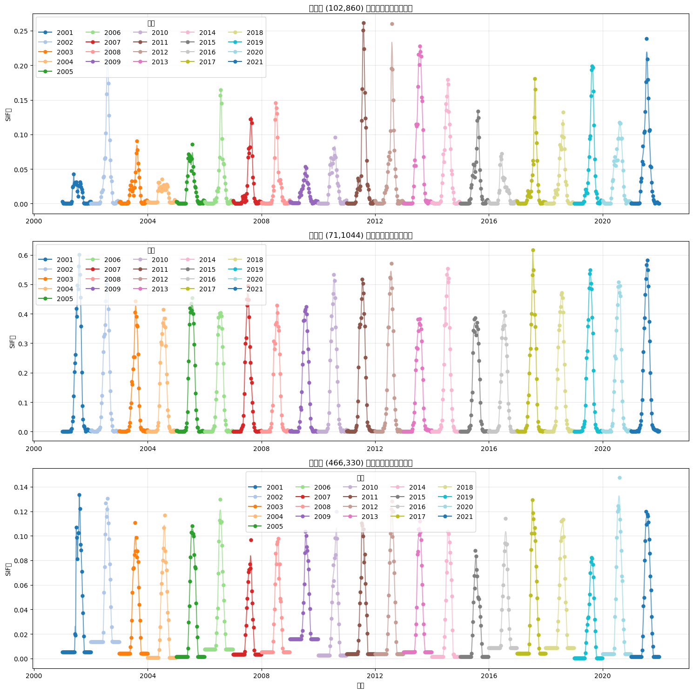
    


```python
import os
import glob
import numpy as np
import rioxarray as rxr
import matplotlib.pyplot as plt
import seaborn as sns
from datetime import datetime, timedelta
from tqdm import tqdm
import pandas as pd
import random
import math

# 设置seaborn风格
sns.set(style="darkgrid")
plt.rcParams['figure.figsize'] = (14, 8)
plt.rcParams['font.size'] = 12

# 输入目录
original_dir = 'E:/data/GOSIF/gosif_china_processed'
interpolated_dir = 'E:/data/GOSIF/gosif_china_4day'

# 获取原始8天的文件
original_files = sorted(glob.glob(os.path.join(original_dir, 'gosif_*.tif')))
interpolated_files = sorted(glob.glob(os.path.join(interpolated_dir, 'gosif_*.tif')))

print(f"找到 {len(original_files)} 个原始8天数据文件")
print(f"找到 {len(interpolated_files)} 个插值4天数据文件")

# 创建日期列表 - 从文件名中提取年份和日期
original_dates = []
for file in original_files:
    filename = os.path.basename(file)
    year = int(filename[6:10])
    day = int(filename[10:13])
    date = datetime(year, 1, 1) + timedelta(days=day-1)
    original_dates.append(date)

interpolated_dates = []
for file in interpolated_files:
    filename = os.path.basename(file)
    year = int(filename[6:10])
    day = int(filename[10:13])
    date = datetime(year, 1, 1) + timedelta(days=day-1)
    interpolated_dates.append(date)

# 读取第一个文件获取空间维度
template = rxr.open_rasterio(original_files[0])
height, width = template.shape[1], template.shape[2]

# 随机选择10个点进行可视化，确保它们在原始数据中不全是NaN
random.seed(42)  # 设置随机种子以便结果可复现
valid_points = []
num_points = 10

print("寻找有效像素点...")
# 为了找到有效点，我们需要检查一些文件
# 从原始文件中随机抽取几个进行检查
sample_files = random.sample(original_files, min(5, len(original_files)))

# 创建一个掩码记录哪些像素有有效数据
valid_mask = np.full((height, width), False)

for file in tqdm(sample_files):
    data = rxr.open_rasterio(file, masked=True).values[0]
    valid_mask = valid_mask | ~np.isnan(data)

# 获取有效像素的坐标
valid_y, valid_x = np.where(valid_mask)
if len(valid_y) > 0:
    # 随机选择10个有效点
    indices = np.random.choice(len(valid_y), min(num_points, len(valid_y)), replace=False)
    valid_points = [(valid_y[i], valid_x[i]) for i in indices]
else:
    print("未找到有效像素点！")
    exit(1)

print(f"找到并选择了 {len(valid_points)} 个有效像素点")

# 准备存储时间序列数据的列表
original_data = []
interpolated_data = []

# 读取原始数据的时间序列
print("读取原始8天数据...")
for i, file in tqdm(enumerate(original_files), total=len(original_files)):
    data = rxr.open_rasterio(file, masked=True).values[0]
    date = original_dates[i]
    
    for j, (y, x) in enumerate(valid_points):
        if y < data.shape[0] and x < data.shape[1]:  # 确保坐标在范围内
            value = data[y, x]
            if not np.isnan(value):
                original_data.append({
                    'Date': date,
                    'Value': value,
                    'Point': f'Point {j+1} ({y},{x})',
                    'Type': 'Original (8-day)'
                })

# 读取插值数据的时间序列
print("读取插值4天数据...")
for i, file in tqdm(enumerate(interpolated_files), total=len(interpolated_files)):
    data = rxr.open_rasterio(file, masked=True).values[0]
    date = interpolated_dates[i]
    
    for j, (y, x) in enumerate(valid_points):
        if y < data.shape[0] and x < data.shape[1]:  # 确保坐标在范围内
            value = data[y, x]
            if not np.isnan(value):
                interpolated_data.append({
                    'Date': date,
                    'Value': value,
                    'Point': f'Point {j+1} ({y},{x})',
                    'Type': 'Interpolated (4-day)'
                })

# 使用concat创建数据框，而不是append
df_original = pd.DataFrame(original_data)
df_interpolated = pd.DataFrame(interpolated_data)
df = pd.concat([df_original, df_interpolated])

# 绘制结果
print("绘制结果...")
for i, point in enumerate(sorted(df['Point'].unique())):
    plt.figure(figsize=(14, 6))
    
    # 获取当前点的数据
    point_data = df[df['Point'] == point]
    
    # 绘制原始和插值数据，两者都使用散点
    sns.scatterplot(
        data=point_data[point_data['Type'] == 'Interpolated (4-day)'],
        x='Date', y='Value',
        color='orange', alpha=0.7, s=30,
        label='Interpolated (4-day)'
    )
    
    sns.scatterplot(
        data=point_data[point_data['Type'] == 'Original (8-day)'],
        x='Date', y='Value',
        color='blue', s=50,
        label='Original (8-day)'
    )
    
    # 设置标题和标签
    plt.title(f'Time Series Comparison for {point}')
    plt.xlabel('Date')
    plt.ylabel('SIF Value')
    plt.legend(loc='best')
    plt.grid(True, alpha=0.3)
    
    # 格式化x轴日期
    plt.xticks(rotation=45)
    plt.tight_layout()
    
    # 保存结果
    plt.savefig(f'comparison_plot_{i+1}.png', dpi=300)
    plt.close()

# 额外绘制一个多点对比的综合图
plt.figure(figsize=(16, 12))

# 为每个点创建一个子图
for i, point in enumerate(sorted(df['Point'].unique())):
    if i >= num_points:
        break
        
    plt.subplot(5, 2, i+1)
    
    # 获取当前点的数据
    point_data = df[df['Point'] == point]
    
    # 为了更清晰地显示时间序列的连续性，绘制细线连接数据点
    # 分别为原始和插值数据排序
    orig_data = point_data[point_data['Type'] == 'Original (8-day)'].sort_values('Date')
    interp_data = point_data[point_data['Type'] == 'Interpolated (4-day)'].sort_values('Date')
    
    # 绘制原始和插值数据的连接线（很细，只是为了显示趋势）
    if not orig_data.empty:
        plt.plot(orig_data['Date'], orig_data['Value'], '-', color='blue', alpha=0.2, linewidth=0.5)
    if not interp_data.empty:
        plt.plot(interp_data['Date'], interp_data['Value'], '-', color='orange', alpha=0.2, linewidth=0.5)
    
    # 绘制散点（两者都使用散点）
    sns.scatterplot(
        data=point_data[point_data['Type'] == 'Interpolated (4-day)'],
        x='Date', y='Value',
        color='orange', alpha=0.7, s=20,
        label='Interpolated (4-day)' if i == 0 else ""
    )
    
    sns.scatterplot(
        data=point_data[point_data['Type'] == 'Original (8-day)'],
        x='Date', y='Value',
        color='blue', s=40,
        label='Original (8-day)' if i == 0 else ""
    )
    
    # 设置标题和标签
    plt.title(point)
    if i >= 8:  # 只在最底部的子图显示x轴标签
        plt.xlabel('Date')
    else:
        plt.xlabel('')
    
    if i % 2 == 0:  # 只在左侧子图显示y轴标签
        plt.ylabel('SIF Value')
    else:
        plt.ylabel('')
        
    # 格式化x轴日期
    plt.xticks(rotation=45)
    
    # 只显示部分年份的刻度，避免拥挤
    years = sorted(list(set([d.year for d in point_data['Date']])))
    tick_positions = [datetime(year, 1, 1) for year in years]
    tick_labels = [str(year) for year in years]
    plt.xticks(tick_positions, tick_labels)
    
    # 调整y轴范围，确保所有子图使用相同的比例
    point_min = point_data['Value'].min()
    point_max = point_data['Value'].max()
    y_margin = (point_max - point_min) * 0.1  # 添加10%的边距
    plt.ylim(point_min - y_margin, point_max + y_margin)

# 添加图例（只显示一次）
plt.figlegend(loc='lower center', ncol=2, bbox_to_anchor=(0.5, 0.01))
plt.tight_layout(rect=[0, 0.03, 1, 0.98])  # 为图例留出空间
plt.suptitle('Comparison of Original (8-day) and Interpolated (4-day) SIF Time Series', fontsize=16)
plt.subplots_adjust(top=0.92, bottom=0.08)  # 调整顶部和底部的空间

# 保存结果
plt.savefig('all_points_comparison.png', dpi=300)
plt.show()
```

    找到 966 个原始8天数据文件
    找到 1917 个插值4天数据文件
    寻找有效像素点...
    

    100%|██████████| 5/5 [00:00<00:00, 72.64it/s]
    

    找到并选择了 10 个有效像素点
    读取原始8天数据...
    

    100%|██████████| 966/966 [00:11<00:00, 83.96it/s]
    

    读取插值4天数据...
    

    100%|██████████| 1917/1917 [00:22<00:00, 86.95it/s]
    

    绘制结果...
    


    
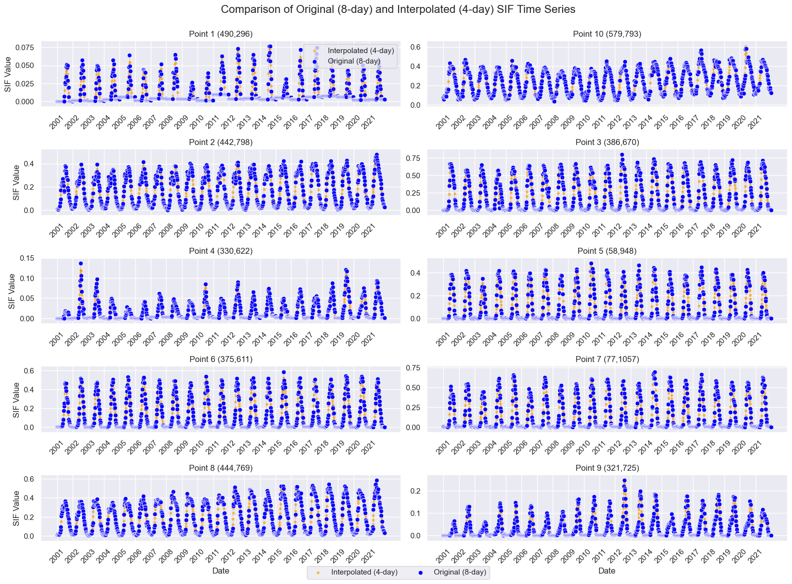
    


# 物候提取


```python
import os
import glob
import numpy as np
import rioxarray as rxr
from datetime import datetime, timedelta
import matplotlib.pyplot as plt
from tqdm import tqdm
import pandas as pd

# 输入目录
input_dir = 'E:/data/GOSIF/gosif_china_4day'
output_dir = 'E:/data/GOSIF/gosif_china_phenology'

# 如果输出目录不存在，创建它
os.makedirs(output_dir, exist_ok=True)

# 获取所有4天间隔的文件
gosif_files = sorted(glob.glob(os.path.join(input_dir, 'gosif_*.tif')))
print(f"找到 {len(gosif_files)} 个4天间隔数据文件")

# 创建日期列表 - 从文件名中提取年份和日期
dates = []
for file in gosif_files:
    filename = os.path.basename(file)
    year = int(filename[6:10])
    day = int(filename[10:13])
    date = datetime(year, 1, 1) + timedelta(days=day-1)
    dates.append(date)

# 按年份分组日期
years = sorted(list(set([d.year for d in dates])))
print(f"数据包含 {len(years)} 个年份: {years}")

# 读取第一个文件以获取元数据和空间维度
template = rxr.open_rasterio(gosif_files[0])
height, width = template.shape[1], template.shape[2]
print(f"栅格尺寸: {height} x {width}")

# 定义物候限制条件
SOS_START_DOY = datetime(2000, 2, 1).timetuple().tm_yday  # 2月1日
EOS_END_DOY = datetime(2000, 12, 31).timetuple().tm_yday  # 12月31日
PEAK_MIN_DOY = datetime(2000, 5, 1).timetuple().tm_yday  # 5月1日
PEAK_MAX_DOY = datetime(2000, 9, 30).timetuple().tm_yday  # 9月30日
MIN_VAL_START_DOY = datetime(2000, 1, 1).timetuple().tm_yday  # 1月1日
MIN_VAL_END_DOY = datetime(2000, 7, 31).timetuple().tm_yday  # 7月31日

# 为每年创建物候结果矩阵
phenology_results = {}
for year in years:
    phenology_results[year] = {
        'sos_20': np.full((height, width), np.nan),
        'sos_50': np.full((height, width), np.nan),
        'sos_80': np.full((height, width), np.nan),
        'eos_20': np.full((height, width), np.nan),
        'eos_50': np.full((height, width), np.nan),
        'eos_80': np.full((height, width), np.nan),
        'peak_doy': np.full((height, width), np.nan),
        'peak_value': np.full((height, width), np.nan),
        'min_value': np.full((height, width), np.nan),
        'amplitude': np.full((height, width), np.nan),
        'growing_season_length': np.full((height, width), np.nan)
    }

# 加载每年的数据
print("按年份加载数据...")
yearly_data = {}
yearly_doys = {}

for year in years:
    # 获取当前年份的文件和日期
    year_indices = [i for i, d in enumerate(dates) if d.year == year]
    year_files = [gosif_files[i] for i in year_indices]
    year_dates = [dates[i] for i in year_indices]
    
    # 计算年积日 (DOY)
    year_doys = [(date - datetime(year, 1, 1)).days + 1 for date in year_dates]
    yearly_doys[year] = year_doys
    
    # 加载该年的所有数据
    year_data = np.full((len(year_files), height, width), np.nan)
    for i, file in enumerate(year_files):
        year_data[i] = rxr.open_rasterio(file, masked=True).values[0]
    
    yearly_data[year] = year_data

print("计算物候点...")
# 对每个像素计算物候点
for y in tqdm(range(height)):
    for x in range(width):
        # 处理每一年
        for year in years:
            year_data = yearly_data[year][:, y, x]
            year_doys = np.array(yearly_doys[year])  # 确保是numpy数组
            
            # 检查是否有足够的有效数据
            valid_indices = np.where(~np.isnan(year_data))[0]
            if len(valid_indices) < 10:  # 需要至少10个有效点
                continue
            
            valid_data = year_data[valid_indices]
            valid_doys = year_doys[valid_indices]
            
            # 提取只在1-7月之间的最小值
            min_doy_indices = np.where((valid_doys >= MIN_VAL_START_DOY) & (valid_doys <= MIN_VAL_END_DOY))[0]
            
            if len(min_doy_indices) < 3:  # 需要至少3个早期有效点
                continue
                
            early_data = valid_data[min_doy_indices]
            early_doys = valid_doys[min_doy_indices]
            
            min_idx = np.argmin(early_data)
            min_value = early_data[min_idx]
            min_doy = early_doys[min_idx]
            
            # 找出当年的最大值（峰值）
            max_idx = np.argmax(valid_data)
            peak_value = valid_data[max_idx]
            peak_doy = valid_doys[max_idx]
            
            # 检查峰值是否在允许的范围内
            if peak_doy < PEAK_MIN_DOY or peak_doy > PEAK_MAX_DOY:
                continue
            
            # 计算振幅
            amplitude = peak_value - min_value
            if amplitude <= 0:
                continue
            
            # 为了找SOS，只考虑最小值DOY到峰值DOY之间的数据
            sos_indices = np.where((valid_doys >= min_doy) & (valid_doys <= peak_doy))[0]
            if len(sos_indices) < 3:  # 需要至少3个有效点计算SOS
                continue
                
            sos_data = valid_data[sos_indices]
            sos_doys = valid_doys[sos_indices]
            
            # 确保sos_data和sos_doys按DOY排序
            sos_sort_idx = np.argsort(sos_doys)
            sos_data = sos_data[sos_sort_idx]
            sos_doys = sos_doys[sos_sort_idx]
            
            # 为了找EOS，只考虑峰值DOY到年末的数据
            eos_indices = np.where(valid_doys >= peak_doy)[0]
            if len(eos_indices) < 3:  # 需要至少3个有效点计算EOS
                continue
                
            eos_data = valid_data[eos_indices]
            eos_doys = valid_doys[eos_indices]
            
            # 确保eos_data和eos_doys按DOY排序
            eos_sort_idx = np.argsort(eos_doys)
            eos_data = eos_data[eos_sort_idx]
            eos_doys = eos_doys[eos_sort_idx]
            
            # 计算阈值
            threshold_20 = min_value + 0.2 * amplitude
            threshold_50 = min_value + 0.5 * amplitude
            threshold_80 = min_value + 0.8 * amplitude
            
            # 计算SOS (20%, 50%, 80%)
            sos_20, sos_50, sos_80 = np.nan, np.nan, np.nan
            
            # 找到第一个超过阈值的点
            for i in range(len(sos_doys)-1):
                if sos_data[i] <= threshold_20 and sos_data[i+1] > threshold_20:
                    # 线性插值
                    sos_20 = sos_doys[i] + (threshold_20 - sos_data[i]) * (sos_doys[i+1] - sos_doys[i]) / (sos_data[i+1] - sos_data[i])
                
                if sos_data[i] <= threshold_50 and sos_data[i+1] > threshold_50:
                    sos_50 = sos_doys[i] + (threshold_50 - sos_data[i]) * (sos_doys[i+1] - sos_doys[i]) / (sos_data[i+1] - sos_data[i])
                
                if sos_data[i] <= threshold_80 and sos_data[i+1] > threshold_80:
                    sos_80 = sos_doys[i] + (threshold_80 - sos_data[i]) * (sos_doys[i+1] - sos_doys[i]) / (sos_data[i+1] - sos_data[i])
            
            # 计算EOS (80%, 50%, 20%)
            eos_20, eos_50, eos_80 = np.nan, np.nan, np.nan
            
            # 找到第一个低于阈值的点
            for i in range(len(eos_doys)-1):
                if eos_data[i] >= threshold_80 and eos_data[i+1] < threshold_80:
                    eos_80 = eos_doys[i] + (threshold_80 - eos_data[i]) * (eos_doys[i+1] - eos_doys[i]) / (eos_data[i+1] - eos_data[i])
                
                if eos_data[i] >= threshold_50 and eos_data[i+1] < threshold_50:
                    eos_50 = eos_doys[i] + (threshold_50 - eos_data[i]) * (eos_doys[i+1] - eos_doys[i]) / (eos_data[i+1] - eos_data[i])
                
                if eos_data[i] >= threshold_20 and eos_data[i+1] < threshold_20:
                    eos_20 = eos_doys[i] + (threshold_20 - eos_data[i]) * (eos_doys[i+1] - eos_doys[i]) / (eos_data[i+1] - eos_data[i])
            
            # 应用限制条件
            if not np.isnan(sos_20) and sos_20 < SOS_START_DOY:
                sos_20 = np.nan
            if not np.isnan(sos_50) and sos_50 < SOS_START_DOY:
                sos_50 = np.nan
            if not np.isnan(sos_80) and sos_80 < SOS_START_DOY:
                sos_80 = np.nan
            
            if not np.isnan(eos_20) and eos_20 > EOS_END_DOY:
                eos_20 = np.nan
            if not np.isnan(eos_50) and eos_50 > EOS_END_DOY:
                eos_50 = np.nan
            if not np.isnan(eos_80) and eos_80 > EOS_END_DOY:
                eos_80 = np.nan
            
            # 计算生长季长度 (使用50%阈值)
            growing_season_length = np.nan
            if not np.isnan(sos_50) and not np.isnan(eos_50):
                growing_season_length = eos_50 - sos_50
            
            # 存储结果
            phenology_results[year]['sos_20'][y, x] = sos_20
            phenology_results[year]['sos_50'][y, x] = sos_50
            phenology_results[year]['sos_80'][y, x] = sos_80
            phenology_results[year]['eos_20'][y, x] = eos_20
            phenology_results[year]['eos_50'][y, x] = eos_50
            phenology_results[year]['eos_80'][y, x] = eos_80
            phenology_results[year]['peak_doy'][y, x] = peak_doy
            phenology_results[year]['peak_value'][y, x] = peak_value
            phenology_results[year]['min_value'][y, x] = min_value
            phenology_results[year]['amplitude'][y, x] = amplitude
            phenology_results[year]['growing_season_length'][y, x] = growing_season_length

# 保存结果
print("保存物候DOY地图...")
for year in years:
    year_dir = os.path.join(output_dir, str(year))
    os.makedirs(year_dir, exist_ok=True)
    
    for metric, data in phenology_results[year].items():
        filename = f"gosif_phenology_{year}_{metric}.tif"
        output_path = os.path.join(year_dir, filename)
        
        # 创建新的栅格
        output_raster = template.copy()
        output_raster.values[0] = data
        
        # 更新描述属性
        output_raster.attrs.update({
            "long_name": f"GOSIF {metric} for year {year}"
        })
        
        # 保存到文件
        output_raster.rio.to_raster(output_path)
```

    找到 1917 个4天间隔数据文件
    数据包含 21 个年份: [2001, 2002, 2003, 2004, 2005, 2006, 2007, 2008, 2009, 2010, 2011, 2012, 2013, 2014, 2015, 2016, 2017, 2018, 2019, 2020, 2021]
    栅格尺寸: 995 x 1232
    按年份加载数据...
    计算物候点...
    

    100%|██████████| 995/995 [05:17<00:00,  3.13it/s]
    

    保存物候DOY地图...
    


```python
for year in years:
    year_dir = os.path.join(output_dir, str(year))
    os.makedirs(year_dir, exist_ok=True)
    
    for metric, data in phenology_results[year].items():
        filename = f"gosif_phenology_{year}_{metric}.tif"
        output_path = os.path.join(year_dir, filename)
        
        # 创建新的栅格
        output_raster = template.copy()
        output_raster.values[0] = data
        
        # 更新描述属性
        output_raster.attrs.update({
            "long_name": f"GOSIF {metric} for year {year}"
        })
        
        # 保存到文件
        output_raster.rio.to_raster(output_path)

# 为验证随机选择几个像素点绘制图形
print("生成验证图表...")
np.random.seed(42)
valid_pixels = []

# 找几个有数据的像素点
for _ in range(5):  # 尝试找5个点
    y = np.random.randint(0, height)
    x = np.random.randint(0, width)
    
    # 检查是否有足够多的年份有有效的物候数据
    valid_years = 0
    for year in years:
        if not np.isnan(phenology_results[year]['sos_50'][y, x]) and \
           not np.isnan(phenology_results[year]['eos_50'][y, x]):
            valid_years += 1
    
    if valid_years >= 3:  # 至少需要3年有效数据
        valid_pixels.append((y, x))
        if len(valid_pixels) >= 3:
            break  # 找到3个点就足够

# 绘制这些点的物候情况
for i, (y, x) in enumerate(valid_pixels):
    plt.figure(figsize=(15, 10))
    
    for year in years:
        # 检查这一年是否有有效的物候数据
        if np.isnan(phenology_results[year]['sos_50'][y, x]) or \
           np.isnan(phenology_results[year]['eos_50'][y, x]):
            continue
        
        # 获取当年的时间序列数据
        year_data = yearly_data[year][:, y, x]
        year_doys = yearly_doys[year]
        valid_indices = np.where(~np.isnan(year_data))[0]
        
        # 根据年份选择不同颜色
        year_idx = years.index(year)
        color = plt.cm.tab10(year_idx % 10)
        
        # 绘制时间序列
        valid_data = year_data[valid_indices]
        valid_doys = np.array(year_doys)[valid_indices]
        plt.scatter(valid_doys, valid_data, color=color, alpha=0.7, label=f"{year}")
        
        # 连接散点
        sorted_indices = np.argsort(valid_doys)
        sorted_doys = valid_doys[sorted_indices]
        sorted_values = valid_data[sorted_indices]
        plt.plot(sorted_doys, sorted_values, color=color, alpha=0.3)
        
        # 标记物候点
        sos_20 = phenology_results[year]['sos_20'][y, x]
        sos_50 = phenology_results[year]['sos_50'][y, x]
        sos_80 = phenology_results[year]['sos_80'][y, x]
        eos_20 = phenology_results[year]['eos_20'][y, x]
        eos_50 = phenology_results[year]['eos_50'][y, x]
        eos_80 = phenology_results[year]['eos_80'][y, x]
        peak_doy = phenology_results[year]['peak_doy'][y, x]
        
        # 计算各物候点的SIF值
        min_value = phenology_results[year]['min_value'][y, x]
        amplitude = phenology_results[year]['amplitude'][y, x]
        
        sos_20_value = min_value + 0.2 * amplitude
        sos_50_value = min_value + 0.5 * amplitude
        sos_80_value = min_value + 0.8 * amplitude
        eos_80_value = min_value + 0.8 * amplitude
        eos_50_value = min_value + 0.5 * amplitude
        eos_20_value = min_value + 0.2 * amplitude
        
        # 绘制物候点
        if not np.isnan(sos_20):
            plt.scatter(sos_20, sos_20_value, color=color, marker='^', s=80, edgecolor='black')
        if not np.isnan(sos_50):
            plt.scatter(sos_50, sos_50_value, color=color, marker='^', s=100, edgecolor='black')
        if not np.isnan(sos_80):
            plt.scatter(sos_80, sos_80_value, color=color, marker='^', s=80, edgecolor='black')
        
        if not np.isnan(eos_80):
            plt.scatter(eos_80, eos_80_value, color=color, marker='v', s=80, edgecolor='black')
        if not np.isnan(eos_50):
            plt.scatter(eos_50, eos_50_value, color=color, marker='v', s=100, edgecolor='black')
        if not np.isnan(eos_20):
            plt.scatter(eos_20, eos_20_value, color=color, marker='v', s=80, edgecolor='black')
        
        if not np.isnan(peak_doy):
            plt.scatter(peak_doy, phenology_results[year]['peak_value'][y, x], color=color, marker='*', s=150, edgecolor='black')
    
    plt.title(f'Pixel ({y},{x}) Phenology', fontsize=16)
    plt.xlabel('Day of Year (DOY)', fontsize=14)
    plt.ylabel('SIF Value', fontsize=14)
    plt.grid(True, alpha=0.3)
    plt.legend(title='Year', fontsize=12)
    
    # 添加月份刻度
    month_doys = [datetime(2000, month, 1).timetuple().tm_yday for month in range(1, 13)]
    month_names = ['Jan', 'Feb', 'Mar', 'Apr', 'May', 'Jun', 'Jul', 'Aug', 'Sep', 'Oct', 'Nov', 'Dec']
    plt.xticks(month_doys, month_names)
    
    plt.tight_layout()
    plt.savefig(f'pixel_{y}_{x}_phenology.png', dpi=300)
    plt.show()

```

    生成验证图表...
    


    
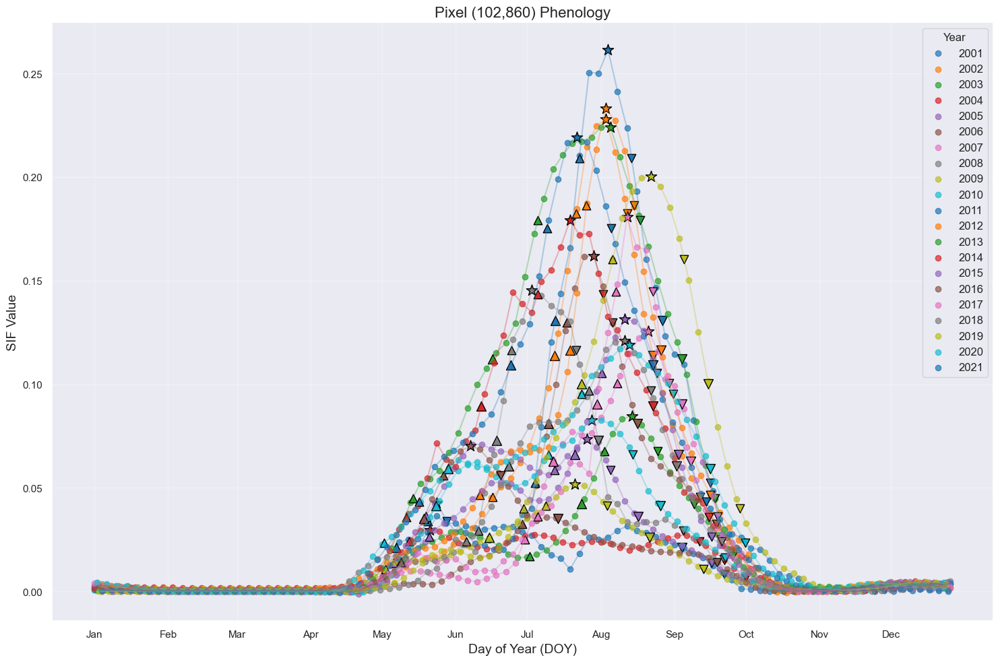
    


    
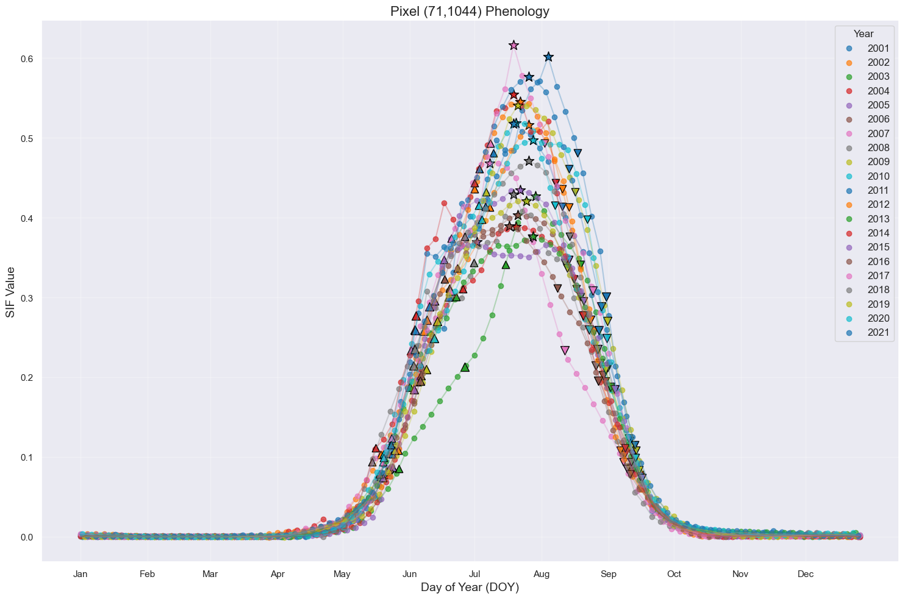
    


    
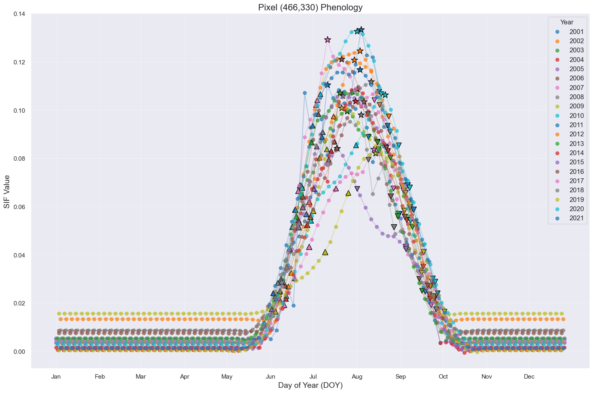
    

